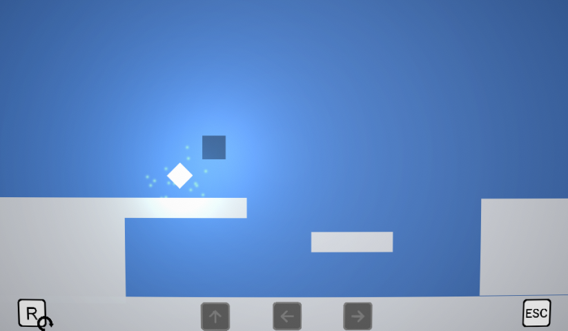

# Out Of Control(s)-GTMK2021
  
  

  

  
  
Out Of Control(s) is a game made with Unity for the [2020 GMTK Game Jam](http://itch.io/jam/gmtk-2020) in the span of 48 hours.  
The theme for this years' Jam was "Out Of Control". We chose to interpret the theme a bit differently and made a game where you have a limited number of ket presses before
you run "Out Of Controls". Currently there is 20 playable levels, we may return to the game to change it's visual aspect and make it mobile-compatible.
It was our second project using the Unity game Engine after a previous gamejam where we were able to learn the basics.

This game was made by theses lovely folks :
* [@mdeloffre](https://github.com/mdeloffre) (music/code)
* [@rubengres](https://github.com/rubengres) (code)  

You can play the game [here](https://ohmlet.itch.io/gmtk-2020)
